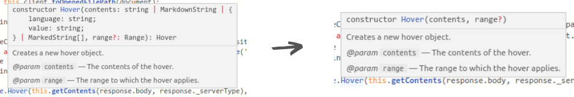

# VSCode Hover Type Hider

> **CURRENTLY NOT WORKING**! If you have the time to fix it, I'll update the extension.

Hides the type of the variables from the mouse over boxes, making a TS method signature to look like pure JS

## Enable/Disable commands
CTRL + SHIFT + P, Enable/Disable Hover Type Hider

**ATTENTION:** this extension will overwrite files inside your VSCode installation folder. It will ask for your permission when doing this. If something goes wrong, you can always reinstall VSCode.

## How does it work?
VSCode is written in Typescript, so its easy to hack the source to make anything happen. I'm using **regexes** to remove the undesired portions of the hover text.

## Known Issues
- **CURRENTLY NOT WORKING**
- this is a very simple extension, the regexes can surely be improved
- should work but not tested on Windows and Mac

## Future
- hide from auto completion boxes as well
- configuration for which parts to hide
- make it easily toggleable, no need to restart
